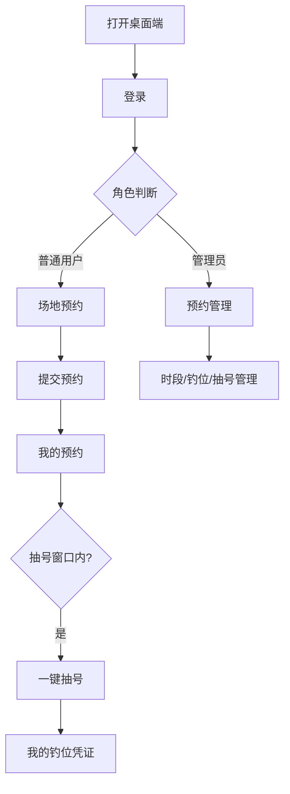

## 1. 产品概述

钓鱼场预约系统桌面端前端是一款面向电脑浏览器的管理型 Web 应用，服务于钓友和管理员两类用户。它以左侧导航 + 右侧内容区的经典后台布局呈现，配合已建成的 Java 后端，提供时段预约、抽号、凭证管理及完整的后台运营能力。

## 2. 核心功能

### 2.1 用户角色

| 角色     | 登录方式   | 核心权限                         |
|----------|------------|----------------------------------|
| 普通用户 | 手机号+密码 | 场地预约、我的预约、我的钓位     |
| 管理员   | 手机号+密码 | 预约管理、时段配置、钓位管理、抽号记录 |

### 2.2 功能模块

1. **登录页**：居中卡片式登录，钓鱼主题渐变背景。
2. **用户端 - 场地预约**：筛选区 + 表格/卡片网格展示时段，支持分页。
3. **用户端 - 我的预约**：表格展示记录，状态标签，一键抽号弹窗，取消预约。
4. **用户端 - 我的钓位**：已抽号钓位凭证卡片，支持打印。
5. **管理端 - 预约管理**：全量预约查询、筛选、手动取消、导出 Excel。
6. **管理端 - 时段配置**：时段 CRUD、启用/禁用。
7. **管理端 - 钓位管理**：钓位 CRUD、状态切换、批量导入。
8. **管理端 - 抽号记录**：抽号记录查询、筛选、导出 Excel。

### 2.3 页面详情

| 页面名称     | 模块名称   | 功能描述                                         |
|--------------|------------|--------------------------------------------------|
| 登录页       | 登录卡片   | 手机号、密码输入，管理员账号提示，登录后按角色跳转 |
| 场地预约页   | 筛选区     | 日期选择器、时段类型下拉框                        |
| 场地预约页   | 时段表格   | 名称、时间范围、剩余名额、状态、操作按钮          |
| 我的预约页   | 记录表格   | 序号、日期、时段、状态、钓位、操作                |
| 我的预约页   | 抽号弹窗   | 旋转加载动画、钓位编号大字展示                    |
| 我的钓位页   | 凭证卡片   | 日期、时段、钓位号、打印按钮                      |
| 预约管理页   | 查询表格   | 日期范围、时段、状态筛选、手动取消、导出          |
| 时段配置页   | 配置表格   | 新增、编辑、启用/禁用弹窗                         |
| 钓位管理页   | 钓位表格   | 编号、状态、新增、禁用/启用                       |
| 抽号记录页   | 记录表格   | 场次、用户、钓位、抽号时间、筛选、导出            |

## 3. 核心流程

用户打开桌面端 → 登录 → 根据角色进入对应首页 → 普通用户浏览时段并预约 → 在我的预约中一键抽号 → 查看我的钓位凭证；管理员进入后台进行预约、时段、钓位、抽号记录管理。

## 4. 用户界面设计

### 4.1 设计风格

- **主色调**：深海蓝 `#0f4c75` 搭配湖泊绿 `#3282b8`，营造沉稳专业的钓鱼场氛围。
- **辅助色**：金色 `#f9a825` 用于抽号等重要操作，成功绿 `#43a047`，警告橙 `#fb8c00`，错误红 `#e53935`。
- **背景色**：内容区浅灰 `#f5f7fa`，侧边栏深蓝 `#0f4c75`。
- **布局**：左侧固定导航 220px，顶部栏 60px，内容区自适应，最小宽度 1200px。
- **字体**：系统默认无衬线字体，标题加粗，正文清晰。
- **组件**：Element Plus 桌面端组件，表格、表单、弹窗、抽屉、分页。

### 4.2 页面设计概览

| 页面名称   | 模块名称   | UI 元素                                              |
|------------|------------|------------------------------------------------------|
| 登录页     | 登录卡片   | 全屏渐变背景、居中卡片、系统标题、账号提示          |
| 场地预约页 | 筛选表格   | 日期选择器、下拉框、搜索按钮、ElTable 表格          |
| 我的预约页 | 状态表格   | 状态标签列、操作按钮列、抽号结果弹窗                |
| 我的钓位页 | 凭证卡片   | 大号钓位号、打印按钮、到场提示                      |
| 管理后台   | 数据表格   | 筛选表单、ElTable、分页、操作按钮                   |

### 4.3 响应式与交互

- 桌面优先，最小宽度 1200px，窗口过小时出现横向滚动。
- 表格数据加载显示 ElLoading 或骨架屏。
- 所有提交按钮带 loading 和防抖。
- 操作结果使用 ElMessage 或 ElNotification 提示。
- 路由权限守卫控制管理员与普通用户访问范围。
