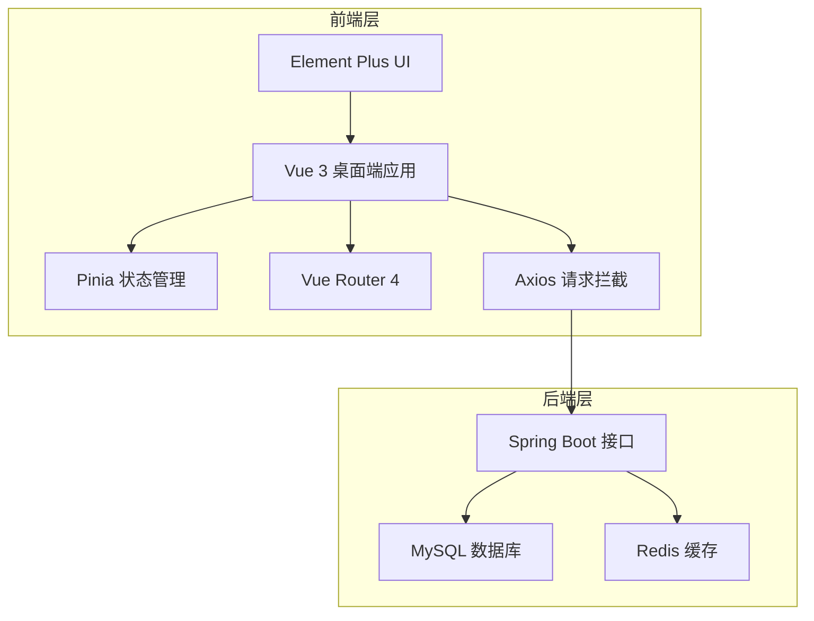

## 1. 架构设计



## 2. 技术说明

- **前端框架**：Vue 3 + Composition API
- **构建工具**：Vite 4
- **UI 组件库**：Element Plus
- **HTTP 客户端**：Axios
- **状态管理**：Pinia
- **路由**：Vue Router 4
- **样式方案**：CSS Variables + Element Plus 主题变量

## 3. 路由定义

| 路由                 | 用途             | 权限     |
|----------------------|------------------|----------|
| /login               | 登录页           | 公开     |
| /user/booking        | 场地预约         | 普通用户 |
| /user/reservations   | 我的预约         | 普通用户 |
| /user/spots          | 我的钓位         | 普通用户 |
| /admin/dashboard     | 管理首页         | 管理员   |
| /admin/reservations  | 预约管理         | 管理员   |
| /admin/slots         | 时段配置         | 管理员   |
| /admin/spots         | 钓位管理         | 管理员   |
| /admin/draws         | 抽号记录         | 管理员   |

## 4. API 定义

复用后端已有接口：

| 接口                         | 方法   | 说明       |
|------------------------------|--------|------------|
| /api/login                   | POST   | 登录       |
| /api/time-slots              | GET    | 时段列表   |
| /api/fishing-spots           | GET    | 钓位列表   |
| /api/reservation             | POST   | 提交预约   |
| /api/reservation/cancel/{id} | PUT    | 取消预约   |
| /api/draw/{reservationId}    | POST   | 一键抽号   |
| /api/admin/reservations      | GET/PUT| 预约管理   |
| /api/admin/time-slots        | CRUD   | 时段配置   |
| /api/admin/fishing-spots     | CRUD   | 钓位管理   |
| /api/admin/draw-results      | GET    | 抽号记录   |
| /api/admin/draw-results/export | GET  | 导出 Excel |

## 5. 项目目录结构

```
fishing-admin/
├── .trae/documents/
├── public/
├── src/
│   ├── api/         # 接口定义
│   ├── assets/      # 静态资源
│   ├── components/  # 公共组件
│   ├── layout/      # 主布局
│   ├── router/      # 路由配置
│   ├── store/       # Pinia 状态
│   ├── utils/       # 工具函数、request 封装
│   ├── views/       # 页面
│   │   ├── user/    # 用户端页面
│   │   └── admin/   # 管理端页面
│   ├── App.vue
│   └── main.js
├── index.html
├── package.json
├── vite.config.js
└── .env
```
