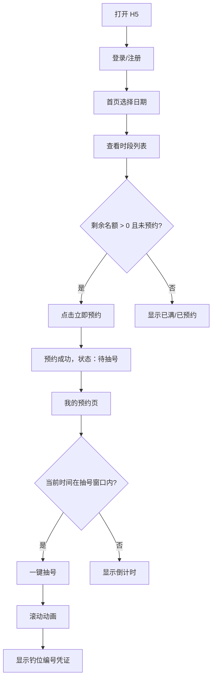

## 1. 产品概述

钓鱼场预约系统 H5 前端是一款面向手机用户的微信小程序风格 Web 应用，解决钓友在线预约时段、参与抽号、管理凭证的痛点。它以单页应用形式运行，配合已建成的 Java 后端，提供从登录、预约、抽号到管理员后台的完整闭环。

## 2. 核心功能

### 2.1 用户角色

| 角色     | 登录方式          | 核心权限                         |
|----------|-------------------|----------------------------------|
| 普通用户 | 手机号+验证码/密码 | 预约时段、一键抽号、查看我的预约 |
| 管理员   | 手机号+密码        | 时段/钓位/预约/抽号管理、Excel导出 |

### 2.2 功能模块

1. **登录/注册页**：手机号+验证码/密码登录，JWT 存储，自动携带 token。
2. **场地预约页（首页）**：日期选择器、可用时段列表、名额实时展示、立即预约。
3. **我的预约页**：预约记录列表、状态标签、倒计时、一键抽号、取消预约。
4. **抽号结果页/弹窗**：滚动动画、定格钓位号、凭证提示。
5. **管理后台（单独布局）**：时段/钓位 CRUD、预约记录查询、抽号记录导出。

### 2.3 页面详情

| 页面名称     | 模块名称   | 功能描述                                         |
|--------------|------------|--------------------------------------------------|
| 登录页       | 登录表单   | 手机号、验证码、密码切换，登录后跳转首页         |
| 场地预约页   | 日期选择   | 从今天起 N 天内可选，N 由后端配置决定            |
| 场地预约页   | 时段卡片   | 展示名称、时间、剩余名额、状态、操作按钮         |
| 我的预约页   | 记录列表   | 日期、时段、状态、钓位、操作按钮                 |
| 我的预约页   | 抽号交互   | 窗口内显示大按钮动画，窗口外显示倒计时           |
| 抽号结果页   | 滚动动画   | 1-2 秒随机滚动后定格显示钓位编号                 |
| 管理后台首页 | 数据看板   | 入口导航，区分用户端与后台                       |
| 管理后台     | 时段管理   | 列表、新增、编辑、启用/禁用、删除                |
| 管理后台     | 钓位管理   | 编号列表、新增、编辑、启用/禁用、删除            |
| 管理后台     | 预约记录   | 按日期/时段筛选、手动取消                        |
| 管理后台     | 抽号记录   | 列表查看、导出 Excel                             |

## 3. 核心流程

用户打开 H5 → 登录获取 token → 进入首页选择日期 → 查看时段与剩余名额 → 点击立即预约 → 预约成功显示待抽号 → 进入我的预约 → 在抽号窗口内点击一键抽号 → 滚动动画 → 显示钓位凭证。

## 4. 用户界面设计

### 4.1 设计风格

- **主色调**：深湖蓝 `#1a5f7a` 搭配自然绿 `#57cc99`，营造户外钓鱼氛围。
- **辅助色**：暖沙黄 `#f6d365` 用于按钮高亮与强调，警告红 `#ff6b6b` 用于已满/过期。
- **背景色**：浅灰蓝 `#f0f4f8` 作为页面底色，卡片使用纯白 `#ffffff`。
- **按钮风格**：大圆角（`border-radius: 9999px`），主按钮使用渐变背景，阴影柔和。
- **字体**：标题使用加粗无衬线字体，正文使用系统默认清晰字体，确保移动端可读性。
- **图标**：使用 Element Plus 图标，简洁统一。
- **布局**：移动端优先，375px 基准宽度，使用 vw/rem 弹性布局，顶部固定导航，内容区卡片堆叠。

### 4.2 页面设计概览

| 页面名称   | 模块名称   | UI 元素                                              |
|------------|------------|------------------------------------------------------|
| 登录页     | 登录表单   | 全屏背景图、手机号输入框、验证码/密码切换、渐变登录按钮 |
| 场地预约页 | 日期选择   | 横向滚动日期条、选中高亮、禁用超出范围日期            |
| 场地预约页 | 时段卡片   | 卡片阴影、时段名称加粗、时间范围、剩余名额徽章、操作按钮 |
| 我的预约页 | 记录卡片   | 顶部状态标签、左侧时段信息、右侧操作区               |
| 我的预约页 | 抽号按钮   | 大圆形脉冲动画按钮、按压缩放效果                     |
| 抽号结果页 | 动画区     | 大号钓位号滚动、最终定格、提示截图保存               |
| 管理后台   | 表格卡片   | Element Plus 表格、分页、搜索筛选、操作按钮          |

### 4.3 响应式与交互

- 以 375px 宽度为基准，使用 `vw` 与 `rem` 混合布局。
- 所有可点击区域不小于 44px，适配触屏。
- 按钮点击添加 `:active` 缩放动画（`transform: scale(0.96)`）。
- 一键抽号按钮使用 CSS 关键帧脉冲动画。
- 下拉刷新使用页面下拉触发重新加载数据。
- 全局使用 ElMessage 做操作反馈，ElLoading 做请求 loading。
