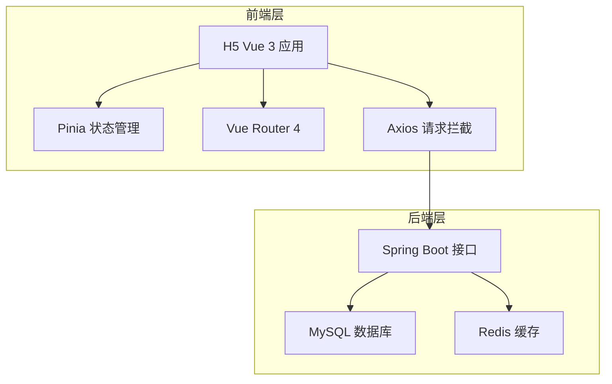

## 1. 架构设计



## 2. 技术说明

- **前端框架**：Vue 3 + Composition API
- **构建工具**：Vite 4
- **UI 组件库**：Element Plus
- **HTTP 客户端**：Axios
- **状态管理**：Pinia
- **路由**：Vue Router 4
- **样式方案**：CSS Variables + vw 适配（使用 postcss-px-to-viewport）

## 3. 路由定义

| 路由                | 用途               | 权限   |
|---------------------|--------------------|--------|
| /login              | 登录/注册          | 公开   |
| /                   | 场地预约首页       | 登录   |
| /reservations       | 我的预约           | 登录   |
| /draw/:id           | 抽号结果页         | 登录   |
| /admin              | 管理后台首页       | 管理员 |
| /admin/slots        | 时段管理           | 管理员 |
| /admin/spots        | 钓位管理           | 管理员 |
| /admin/reservations | 预约记录查询       | 管理员 |
| /admin/draws        | 抽号记录查看/导出  | 管理员 |

## 4. API 定义

基于已完成后端接口：

| 接口               | 方法   | 说明         |
|--------------------|--------|--------------|
| /auth/login        | POST   | 登录         |
| /api/reservation   | POST   | 提交预约     |
| /api/reservation/cancel/{id} | PUT | 取消预约 |
| /api/draw/{reservationId}    | POST | 一键抽号 |
| /api/admin/time-slots        | CRUD | 时段管理 |
| /api/admin/fishing-spots     | CRUD | 钓位管理 |
| /api/admin/reservations      | GET  | 预约记录 |
| /api/admin/draw-results      | GET  | 抽号记录 |
| /api/admin/draw-results/export | GET | 导出 Excel |

## 5. 数据模型

与后端实体对应：

- TimeSlot：id, slotDate, slotName, startTime, endTime, maxBookings, advanceDays, drawStartTime, drawEndTime, status
- FishingSpot：id, spotCode, status
- Reservation：id, userId, slotId, status, createTime, cancelTime
- DrawResult：id, reservationId, userId, slotId, spotId, drawTime

## 6. 项目目录结构

```
fishing-h5/
├── .trae/documents/
├── public/
├── src/
│   ├── api/         # 接口定义
│   ├── assets/      # 静态资源
│   ├── components/  # 公共组件
│   ├── router/      # 路由配置
│   ├── store/       # Pinia 状态
│   ├── utils/       # 工具函数、request 封装
│   ├── views/       # 页面
│   ├── App.vue
│   └── main.js
├── index.html
├── package.json
├── vite.config.js
└── postcss.config.js
```
